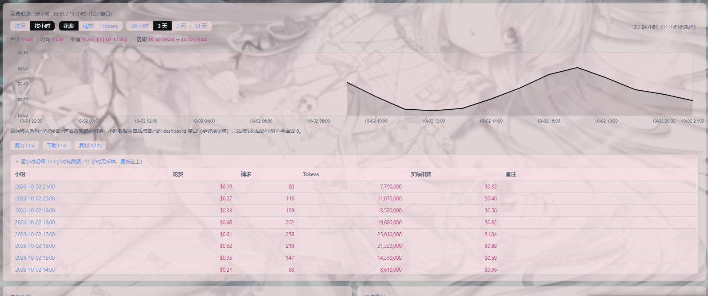
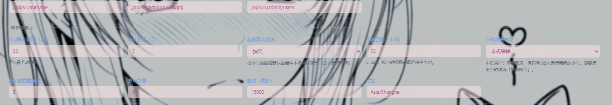

# dsh-sub2api-usage

把 Sub2API 的余额和用量搬进 [DeepSeek Harness](https://github.com/deepseek-ai) 的左侧边栏：底部常驻一条实时余额，点开是完整用量面板，**查询接口的每一部分都能在界面上改**。

> **English** — A DeepSeek Harness sidebar plugin for Sub2API: an always-visible balance chip at the bottom of the sidebar, a full usage panel (balance / quota / subscription / daily / per-model / rate limits / raw response), and a settings tab where the base URL, mode, paths, headers and JSON pointers are all customisable. Every upstream request is issued by the host process, so your Sub2API site needs no CORS and the credential never reaches the page.
>
> ```powershell
> dsh plugin --profile desktop add github:aming1029/dsh-sub2api-usage
> ```


[](https://github.com/aming1029/dsh-sub2api-usage/actions/workflows/test.yml) **状态** v1.0.0 · **测试** 123 项 `node:test`（CI 在 Node 20 / 22 / 24 上跑 `npm test`），另在真实部署上跑通 · **依赖** DSH（带插件管理器）、Node ≥ 18 · **许可证** [MIT](LICENSE)

## 目录

- [它能做什么](#它能做什么)
- [安装](#安装)
- [快速开始](#快速开始)
- [面板说明](#面板说明)
- [按小时看用量（本机采样）](#按小时看用量本机采样)
- [查询模式](#查询模式)
- [设置项参考](#设置项参考)
- [JSON 指针怎么写](#json-指针怎么写)
- [宿主 HTTP 接口](#宿主-http-接口脚本调用)
- [配置文件](#配置文件)
- [安全边界](#安全边界)
- [排错](#排错)
- [开发](#开发)
- [更新与卸载](#更新与卸载)
- [适配别的站点](#适配别的站点)

## 它能做什么

| 位置 | 内容 |
| --- | --- |
| 侧边栏底部（「设置」旁边） | 常驻余额小条：`$12.34 用量`，带状态圆点，点一下打开面板 |
| 侧边栏图标区 | 一个「Sub2API 用量」图标，和「插件 / 自动化任务」并列 |
| 主面板 · 概览 | 钱包余额、账户、剩余额度；额度使用条；订阅日/周/月；**用量趋势折线图**（按天 / 按小时切换、悬停读数、切换指标、切换区间）；模型用量；限流窗口 |
| 主面板 · 明细 | 识别到的字段清单、每个上游请求的状态码、**原始响应 JSON** |
| 主面板 · 设置 | 服务地址、模式、凭证、路径、JSON 指针、刷新间隔……全部可改 |

三种凭证（管理员 Key / 站点 Key / 账号密码）和「完全自定义请求」都支持，不写死任何一种部署；后台按间隔自动刷新（默认 120 秒），余额低于阈值时小条和图标冒黄点。

## 安装

### 前置条件

- DeepSeek Harness，且命令行里有 `dsh`（本仓库按 `--profile desktop` 举例，换成你自己的 profile 名）。
- Node ≥ 18（`package.json` 的 `engines` 要求）。
- 一个可访问的 Sub2API 部署，以及下面任意一种凭证。

### 从 GitHub 安装

```powershell
dsh plugin --profile desktop add github:aming1029/dsh-sub2api-usage
```

### 从本地目录安装

```powershell
git clone https://github.com/aming1029/dsh-sub2api-usage
dsh plugin --profile desktop add file:D:/path/to/dsh-sub2api-usage
```

> **装不上？** `dsh plugin add github:…` 需要能从你这台机器访问 `github.com`（git 走 443）。
> 网络受限时用上面的 `file:` 方式，或者只把目录拷过来（`lib/`、`cordis.patch.yml`、`package.json` 三个是运行必需的）。

### 确认装好了

装好后**不用重启**：插件管理器会把它加进加载器树并即时生效，已经在开的页面通过 HMR 自动挂载。侧边栏底部应该立刻出现「未配置 用量」小条。

没出现就按 `F5` 刷新页面；还是没有，看[排错](#排错)。

## 快速开始

1. 点侧边栏底部的余额小条（或图标区的「Sub2API 用量」）打开面板。
2. 切到「设置」，按下面的表选一种模式填凭证。
3. 点「保存并查询」。想先验证再保存，就点「测试连接（不保存）」——它用当前填的内容真发一次请求，但不写盘。

| 模式 | 填什么 | 能查到 |
| --- | --- | --- |
| 站点 Key | `sk-…` | 该 Key 的钱包余额、订阅日/周/月、限流窗口、区间内的模型与按天用量 |
| 管理员 | 后台「系统设置 → 管理员 API Key」生成的 `admin-…`；填「用户 ID」查单个用户，留空或勾选「拉取用户列表」查列表 | 任意用户的 `balance / frozen_balance / total_recharged` |
| 账号密码 | 邮箱 + 密码（或直接填一个已登录的访问令牌） | 当前登录账号 |
| 自定义请求 | 方法 / 路径 / 请求头 / 请求体（+ 可选的 JSON 指针） | 任何返回余额的接口 |

不确定用哪种就选默认的「自动识别」：它按凭证形状判断——`admin-…` → 管理员，`sk-…` → 站点 Key，JWT 或邮箱密码 → 账号。

## 面板说明

### 侧边栏小条

| 显示 | 含义 |
| --- | --- |
| `$12.34 用量` + 绿点 | 查询正常 |
| 同上 + **黄点** | 余额低于「低余额提醒阈值」（默认 5），只是提醒，不是错误 |
| `未配置 用量` + 红点 | 还没填凭证（首次使用的正常状态） |
| `查询失败 用量` + 红点 | 请求出错，点开面板看红条里的原因 |

鼠标悬停小条会显示上次查询时间。

### 概览

按接口实际返回的内容渲染，**没有的字段不会硬凑**：管理员响应里没给你「冻结/已充值」就不显示那张卡；「剩余额度」和余额相同时也不重复显示。额度条、订阅日/周/月、按天用量折线图、模型用量、限流窗口同理，有才画。

### 用量趋势（折线图）



图里是**按小时**视图：折线上有断口的地方就是没采样的小时（不是 0），下面那串按钮是导出，再下面是展开的逐小时明细表。按天视图同一套操作，只是横轴换成日期。

- **按天 / 按小时**：左上角切换粒度，选择会存进「趋势默认粒度」，下次打开还是这个视图。
- **按天折线**：纵轴刻度取整到 1 / 2 / 2.5 / 5 这类好读的整数，横轴按面板宽度自动抽稀日期标签，永远不会挤成一团。
- **悬停看单日**：鼠标移到某一天，出现十字线 + 读数框，给出当天花费和站点返回的请求数、Tokens、实际扣费；也可以用 `Tab` 聚焦图表后按 `←` `→` 逐天查看（键盘操作不依赖鼠标）。
- **切换指标**：站点在按天数据里返回了请求数或 Tokens 时，左上角会出现「花费 / 请求 / Tokens」切换；没返回的指标**不会显示成一个点不动的空页签**。
- **区间快捷键**：按天是 `7 / 14 / 30 / 90 天`（写回「统计区间（天）」），按小时是 `24 小时 / 3 / 7 / 14 天`（写回「小时区间（小时）」）——都是保存配置，不是临时过滤，所以自动刷新后区间还在。
- **统计行**：合计、日均（按小时视图是「时均」）、峰值（带日期或小时）、实际区间。
- **明细表**：按小时视图下面有一张「逐小时明细」（小时 / 花费 / 请求 / Tokens / 实际扣费 / 备注），最新的小时在最上面，没采样的小时照样占一行并写明原因——折线看形状，表格对数字。
- **导出**：图表下方三个按钮——`复制 CSV`、`下载 CSV`、`复制 JSON`。CSV 是当前视图逐行导出（表头 + 每小时一行，未采样的行留空），带 UTF-8 BOM 和 CRLF，Excel 直接打开不乱码；JSON 是完整快照，排查问题时贴出来就够。
- **降级**：区间里没有数据时显示空状态；只有一天数据时画一个点而不是一条看不出趋势的线。

### 按小时看用量（本机采样）

Sub2API 的 `sk-…` 接口**只按天返回**用量：请求里加 `granularity=hour` 也照样是 `daily_usage`；站点自己的小时接口（`/api/v1/usage/dashboard/…?granularity=hour`）要登录令牌，站点 Key 打不开（实测返回 `Invalid token`）。

所以按小时的数据由插件**自己按小时采样**：每次查询拿到的响应里都带「今天累计」（`usage.today`，或当天那条 `daily_usage`），宿主把相邻两次相减，差值记进它落到的那一个小时。代价和边界都摆明：

| 情况 | 表现 |
| --- | --- |
| 插件没在运行的小时 | 空着（线在这里断开），**不会画成 0**——没数据就是没数据 |
| 采样间隔被拉长（DSH 关过、休眠过） | 这段用量整段记在到达的那一小时，读数框里标「含中断时段」 |
| 跨过站点时区的零点 | 计数器归零时按新一天算，不会出现负数或巨大跳变 |
| 一小时里确实没人用 | 正常的 0（插件在跑就有这一笔） |
| 别的模式（管理员 / 账号） | 响应里没有累计值就不采样，按小时视图会说明「还没有小时数据」 |

保留最近 **14 天（336 小时）**，存在 `$DSH_HOME/sub2api-usage.hourly.json`；页面上的「小时区间」决定看其中多少小时。采样不需要额外面向上游的请求——它搭在本来就要发的查询上，刷新间隔（默认 120 秒）就是采样间隔。

折线下面还有一张**逐小时明细表**（默认折叠，点一下展开）：每行一小时，最新的在最上面，空的小时也占一行并写明「无采样（插件当时没运行）」，被拉长的那一小时标「含中断时段」。要对数字就用表格，看形状用折线。

`复制 CSV` / `下载 CSV` 导出的就是这张表（按天视图则导出逐日数据），带 BOM 和 CRLF；`复制 JSON` 导出完整快照。**注意：DSH 自己的窗口会静默拦掉 blob 下载**（没有文件、也没有弹窗），而且"下载被取消"在页面里无法检测——所以「下载 CSV」在触发下载的**同时**把同一份内容放进剪贴板，提示语会说明到底发生了什么。没看到文件就直接粘到 Excel。

#### 换成站点自己的小时接口（可选）

站点确实有小时接口，只是要**登录令牌**。把「小时数据来源」改成 `site` 之后，宿主会走站点的 dashboard 接口：

```
POST /api/v1/auth/login              { email, password } → access_token
GET  /api/v1/usage/dashboard/trend?start_date=&end_date=&granularity=hour&timezone=
     → { code: 0, data: { trend: [ { date, requests, total_tokens, cost, actual_cost, … } ] } }
```

接口路径和字段名是从站点自己的前端 bundle 里读出来的（它的 `usage` API 模块和 dashboard 图表），不是猜的；`granularity` 在那个下拉框里确实只有 `day` / `hour` 两个值。认证方式三选一：**账号模式填邮箱密码**（宿主登录后拿 `access_token`）、**把浏览器里的 `auth_token` 填进凭证框**、或者管理员令牌（如果站点允许）。

开关就在设置页的「刷新与显示」里（和「小时区间」同一排）：



好处是**历史小时不用等采样**、来源是站点账本；代价和边界：

| 情况 | 表现 |
| --- | --- |
| 站点接口失败（令牌过期 / 401 / 超时 / 返回结构不认识） | 面板里写明失败原因，同时**退回本机采样**继续画，绝不编数据 |
| 账号开了两步验证 | 登录会停在 `/auth/login/2fa`：这时请把浏览器里的 `auth_token` 直接填进凭证框 |
| 站点没返回某一小时 | 那一格是空（表格里写「站点没有返回这一小时」），不是 0 |
| `date` 标签格式没见过 | 解析不了的行走「未解析计数」，不会被当成 0 混进曲线 |
| 默认值 | `sampled`：不主动改，行为与以前完全一致，也不需要登录 |

### 明细

三块内容：识别到的字段（扁平化的 `路径 = 值` 列表）、每个上游请求的 URL 与状态码、原始响应 JSON。**换了站点或接口返回格式变了，先来这里对字段**，再决定要不要填指针。


### 设置


设置分四组：**查询接口**（服务地址、查询模式、凭证）、**字段映射与路径**、**刷新与显示**、自定义请求。改完点「保存并查询」，会先写配置再立刻查一次；「测试连接（不保存）」只试不写。后面几节逐项说明；「刷新与显示」里的「小时数据来源」下拉框长什么样，见上面[换成站点自己的小时接口](#换成站点自己的小时接口可选)那一节。

## 查询模式

| 模式 | 上游请求 | 认证 |
| --- | --- | --- |
| `key`（站点 Key） | `GET /v1/usage?start_date=&end_date=&timezone=` | `Authorization: Bearer sk-…` |
| `admin`（单个用户） | `GET /api/v1/admin/users/{id}` | `x-api-key: admin-…` 或管理员 `Bearer <JWT>` |
| `admin`（用户列表） | `GET /api/v1/admin/users?search=&page=&page_size=&sort_by=&sort_order=` | 同上 |
| `user`（账号） | `POST /api/v1/auth/login` → `GET /api/v1/auth/me` | 登录返回的 `access_token` |
| `custom`（自定义） | 你自己写的方法 / 路径 / 请求头 / 请求体 | 你自己写 |

响应既支持标准包封 `{code, message, data}`（`code != 0` 时把站点原文和修复建议一起报出来），也支持裸对象。

**所有上游请求都由宿主（Node 侧）发出**：站点不需要开 CORS，凭证也不会出现在页面里。

## 设置项参考

界面上能改的全部设置项、对应的配置文件字段和默认值：

### 查询接口

| 设置项 | 配置键 | 默认 | 说明 |
| --- | --- | --- | --- |
| 服务地址 | `baseUrl` | `https://aiapi.aaming.icu` | 任意 sub2api 部署；结尾斜杠会被去掉 |
| 查询模式 | `mode` | `auto` | `auto` / `admin` / `key` / `user` / `custom` |
| 凭证 | `credential` | 空 | 三态：留空=保持不变，填内容=替换，点「清除凭证」=清空 |
| 邮箱 / 密码 | `email` `password` | 空 | 仅账号模式使用 |
| 用户 ID | `adminUserId` | 空 | 管理员模式；留空或勾选下面的列表则查用户列表 |
| 搜索关键词 | `search` | 空 | 管理员列表的过滤条件 |
| 拉取用户列表 | `listUsers` | `false` | 勾上则查列表而不是单个用户 |

### 自定义请求（模式选 `custom` 时）

| 设置项 | 配置键 | 默认 |
| --- | --- | --- |
| 方法 | `custom.method` | `GET` |
| 路径 | `custom.path` | `/v1/usage?start_date={start}&end_date={end}&timezone={timezone}` |
| 请求头（JSON 对象） | `custom.headers` | 空 |
| 请求体（JSON，GET 可留空） | `custom.body` | 空 |

路径里可用的占位符：`{start}` `{end}` `{timezone}` `{id}`。**没填的占位符会原样保留**（便于一眼看出配置漏了）。

### 字段映射与路径

| 设置项 | 配置键 | 默认 | 说明 |
| --- | --- | --- | --- |
| 余额 JSON 指针 | `pointers.balance` | 空 = 自动识别 | 见[下一节](#json-指针怎么写) |
| 剩余额度指针 | `pointers.remaining` | 空 | 与余额不同时才单独显示一张卡 |
| 已用指针 | `pointers.used` | 空 | 额度进度条的分子 |
| 额度上限指针 | `pointers.limit` | 空 | 额度进度条的分母 |
| 用量路径 | `paths.usage` | `/v1/usage` | |
| 当前用户路径 | `paths.me` | `/api/v1/auth/me` | |
| 管理员单用户路径 | `paths.adminUser` | `/api/v1/admin/users/{id}` | `{id}` 会被「用户 ID」替换 |
| 管理员用户列表路径 | `paths.adminUsers` | `/api/v1/admin/users` | |

还有几个只在配置文件里、界面上没放输入框的项（一般用不到）：

`paths.login`（`/api/v1/auth/login`）、`paths.trend`（`/api/v1/usage/dashboard/trend`）、`paths.profile`（`/api/v1/user/profile`）、`pointers.frozen`、`pointers.recharged`（不填也会自动识别 `frozen_balance` / `total_recharged`）、`page`、`pageSize`、`sortBy`、`sortOrder`、`currency`。

### 刷新与显示

| 设置项 | 配置键 | 默认 | 范围 / 说明 |
| --- | --- | --- | --- |
| 自动刷新间隔（秒） | `intervalSec` | `120` | `0` = 只手动刷新；失败后也不会比这个间隔更快重试 |
| 统计区间（天） | `rangeDays` | `30` | 1–365 |
| 趋势默认粒度 | `granularity` | `day` | `day` 或 `hour`：面板打开时趋势图先显示哪种 | 
| 小时区间（小时） | `hourlyHours` | `24` | 6–336（本机采样最多保留 14 天） |
| 小时数据来源 | `hourlySource` | `sampled` | `sampled` = 插件本机采样；`site` = 站点自己的 dashboard 接口（要登录令牌，见下节） |
| 低余额提醒阈值 | `lowBalance` | `5` | 余额低于它时小条和图标出现黄点 |
| 货币符号 | `currencySymbol` | `$` | 只影响显示 |
| 超时（毫秒） | `timeoutMs` | `15000` | 1000–120000 |
| 时区 | `timezone` | `Asia/Shanghai` | 作为 `{timezone}` 占位符和查询参数发给站点 |

## JSON 指针怎么写

指针用来从返回的 JSON 里取数，下面这些写法都认：

| 写法 | 例子 |
| --- | --- |
| 带斜杠的 JSON Pointer | `/data/quota/remaining` |
| 点号路径 | `data.balance` |
| 数组下标（两种都行） | `/data/items[0]/balance`、`data.items.0.balance` |

留空表示自动识别，内置会依次尝试这些常见位置：

- **余额**：`/data/balance`、`/balance`、`/data/user/balance`、`/user/balance`、`/data/account/balance`、`/data/wallet/balance`、`/data/remaining`、`/remaining`、`/data/quota/remaining`、`/quota/remaining`
- **冻结 / 已充值**：`/data/frozen_balance`、`/data/frozenBalance`、`/data/total_recharged`、`/data/totalRecharged`
- **已用 / 上限**：`/data/quota/used`、`/data/subscription/used_usd`、`/data/quota/limit`、`/data/subscription/limit_usd`

取不到值时不会崩，明细页会把识别到的字段全列出来，照着复制一个指针过去就行。

## 宿主 HTTP 接口（脚本调用）

面板用的接口也在本机 HTTP 上，可以直接 `curl` 用来做脚本或监控：

| 方法 | 路径 | 说明 |
| --- | --- | --- |
| `GET` | `/sub2api-usage/api/state` | 掩码后的配置 + 上次快照 + 配置文件路径 |
| `POST` | `/sub2api-usage/api/config` | 保存配置补丁（凭证三态同上） |
| `POST` | `/sub2api-usage/api/query` | 用已保存的配置查询；可带 `{"days":7}` 或 `{"start":"2026-09-01","end":"2026-09-30"}` 临时改区间 |
| `POST` | `/sub2api-usage/api/test` | 用候选配置试查，不保存：`{"config":{...}}` |

```powershell
# 查一次，只看余额
curl.exe -s -X POST http://127.0.0.1:19387/sub2api-usage/api/query -H "content-type: application/json" -d "{}"
```

端口就是 DSH Web 的端口（看环境变量 `DSH_WEB_URL`，当前实例是 `http://127.0.0.1:19387`）。**只有本机来源能调用**，别的地址一律 403。

## 配置文件

| 文件 | 内容 | 权限 |
| --- | --- | --- |
| `%DSH_HOME%\sub2api-usage.json` | 服务地址、模式、路径、指针、刷新间隔等（**可以安全分享**） | 普通 |
| `%DSH_HOME%\sub2api-usage.secrets.json` | 只有凭证和密码 | 0600 |

- `DSH_HOME` 默认是 `~/.dsh`（Windows 上常见 `D:\dsh-home`）。
- 想放到别处就设环境变量 `DSH_SUB2API_DIR`，两个文件都跟着走。
- 面板「设置」页底部会显示这两个文件的真实路径。
- 两个文件都是原子写入（先写临时文件再改名），写坏了也不会留下半个 JSON。

## 安全边界

- **只服务回环地址**：`/sub2api-usage/api/*` 对非本机来源返回 403。这个接口持有凭证、而且能被指向任意地址，不能暴露到局域网。反过来说，任何本机进程本来就能读配置文件，所以这不是额外的信任边界。
- **凭证不出宿主**：浏览器半区拿到的是 `sk-t…7890` 这样的掩码提示，原始凭证不会出现在页面、也不会进浏览器存储。
- **凭证是明文**：存在 `sub2api-usage.secrets.json`（本机当前用户可读）。要更严格的隔离，请用系统凭据管理，或收紧该目录权限。
- **「测试连接」会真发请求**：用的是你当前填在表单里的地址和凭证，但不写盘。
- **服务地址可以是任意地址**：这是「可自定义」的代价。别把面板指向不可信的地址，否则下次刷新就会把你的凭证发给它。

## 排错

| 现象 | 原因 / 处理 |
| --- | --- |
| 小条显示「未配置」 | 还没填凭证：面板 → 设置 → 填一种，点「保存并查询」。 |
| 小条显示「查询失败」 | 打开面板看红条：里面有错误码、站点返回的原文和修复建议。 |
| 401 / 403 | 凭证类型和模式不匹配：`admin-…` 要用管理员模式，`sk-…` 用站点 Key；也可能是 Key 被停用。 |
| 404 | 路径不对：在「管理员单用户路径」等地方改成你的部署实际路径。明细页的原始响应里能看到站点到底返回了什么。 |
| 有数据但余额是空的 | 指针没命中：翻明细页的字段清单，把对应路径填进「余额 JSON 指针」。 |
| 提示「宿主路由未加载」 | 宿主半区没挂上：确认插件是启用状态，重装一次（`dsh plugin --profile desktop add …`），必要时重启 DSH。 |
| 提示「无法连接宿主接口」 | 页面连不上 DSH 自己的 Web 端口：确认 DSH 还在运行、端口没变（看 `DSH_WEB_URL`）。 |
| 点了图标没反应 | 插件正在重挂载（改装/启停的瞬间）。等一秒再点，或用侧边栏列表里的那一行。 |
| 数字一直不动 | 「自动刷新间隔」是 `0`：改成 `60` 之类，或点右上角「刷新」。 |
| 图标一直有黄点 | 余额低于阈值，属于正常提醒；嫌烦就把「低余额提醒阈值」改成 0 或更小的数。 |
| 请求超时 | 调大「超时（毫秒）」；站点慢或走了代理时常见。 |
| 站点有 Cloudflare / 校验 UA | 把模式切到「自定义请求」，在请求头里补上需要的头。 |
| 改了源码没生效 | pnpm 装的是硬链接副本：跑 `node scripts/deploy.mjs`，再按 F5。 |
| 改了 `lib/index.js` / 归一化后没生效 | 宿主半区只在 DSH 启动时加载：`deploy.mjs` 之后要**重启 DSH**，停用再启用插件不会重新导入。 |
| 折线图只有「花费」一个指标 | 站点没有在按天数据里返回请求数 / Tokens：面板只显示真正有数据的指标，不会给空页签。 |
| 按小时视图空着 | 本机采样从插件运行后才开始累计：连开几次刷新就有数据；「按天」视图不受影响。 |
| 按小时视图里有一段断开 | 那些小时插件没在运行，没有数据——故意不画成 0。 |
| 点了「下载 CSV」没看到文件 | DSH 的外壳会静默拦掉 blob 下载（`link.click()` 不报错，文件就是不落地，页面里也检测不到）。按钮在触发下载的同时把内容放进了剪贴板，直接粘到 Excel 即可。 |
| 剪贴板也没动静 | 浏览器要求剪贴板写入必须发生在点击手势里；如果是通过脚本远程点的按钮，手势可能不在。手动点一下「复制 CSV」即可。 |

## 开发

```powershell
cd dsh-sub2api-usage
npm test                        # 123 项：纯逻辑 21 + 上游端到端 13 + 宿主路由 16 + 配置存储 11 + 小时采样 12 + 站点小时 9 + 客户端与图表 34 + 文档校验 7
node scripts/deploy.mjs         # 把改动同步到已安装它的 profile（自动找 DSH_HOME）
```

> `npm test` 逐个点名测试文件是有原因的：`node --test`（不给参数）会把 `test/` 下**所有** `.mjs` 都当测试文件跑，包括 `harness.mjs` 和 `mock-sub2api.mjs`——后者一旦被当测试文件执行就会起一个永不退出的假站点，整个测试跟着挂住。所以 mock 的 CLI 入口放在 `scripts/mock-sub2api.mjs`，`test/` 下的模块保持零副作用，`test/readme.test.mjs` 里有一条测试盯着 `package.json` 的测试清单不能漏文件。

CI（`.github/workflows/test.yml`）就是这三个版本上跑这一条 `npm test`，零依赖、不需要 `npm install`。

`test/readme.test.mjs` 会检查这份文档本身：截图路径存在、目录锚点指向真实标题、写出来的默认值和 `lib/core.js` 的 `DEFAULT_CONFIG` 一致、脚本接口和 `lib/index.js` 注册的路由对得上。

折线图的几何是**在客户端 bundle 里手写的纯函数**（浏览器半区只能 `require("react")`，拿不到 `lib/core.js`），所以 `test/client.test.mjs` 直接用精确坐标断言渲染出来的 SVG：路径 `d`、五个纵轴刻度文案、悬停带数量、切换指标后的重算、方向键行走、区间按钮回写配置。改坏几何或标签，测试会红。

**改哪一半，怎么生效**（这条踩过坑）：

| 改动的文件 | 生效方式 |
| --- | --- |
| `lib/client.js`、`lib/core.js` 里的展示逻辑、CSS | `node scripts/deploy.mjs` → 刷新页面（`F5`） |
| `lib/index.js`（宿主路由）、`lib/core.js` 的归一化、`lib/store.js`、`lib/samples.js`、`lib/site-hours.js` | `deploy.mjs` → **重启 DSH**：宿主半区是 Node 模块，进程启动时加载一次，停用/启用插件不会重新导入 |

`test/mock-sub2api.mjs` 是一个本地假站点，覆盖 admin / key / user / custom / 超时 / 非 JSON 各种返回，既能被测试直接引用，也能单独跑起来手工验证：

```powershell
npm run mock                    # 等价于 node scripts/mock-sub2api.mjs 8799
# 再把面板指向 http://127.0.0.1:8799，凭证填 sk-testkey1234567890
```

`MOCK_ANY_KEY=1` 会让假站点接受任意凭证——只为「不想重新输入真 Key，又想拿本地数据截图」这种场景准备，测试不会设它，所以那几条 401 分支照样被覆盖。

### 目录结构

```
dsh-sub2api-usage/
├── package.json          # dsh.bundle.patch + dsh.client(platform:web)
├── cordis.patch.yml      # 往 profile 加载器树里插一条 entry
├── lib/
│   ├── core.js           # 纯逻辑：配置、指针、请求计划、快照归一化（零依赖）
│   ├── query.js          # 执行计划 + 错误分类
│   ├── store.js          # 配置持久化（配置与凭证分开、原子写、单飞加载）
│   ├── samples.js        # 小时采样：把「今天累计」的差值记进所属小时
│   ├── site-hours.js     # 可选：站点 dashboard 小时接口（登录令牌）→ 同样的小时桶
│   ├── index.js          # 宿主半区：/sub2api-usage/api/{state,config,query,test}
│   └── client.js         # 浏览器半区：侧边栏小条 + 面板图标 + 主面板 + 折线图几何
├── scripts/
│   ├── deploy.mjs        # 同步到 profile
│   └── mock-sub2api.mjs  # 手工跑假站点（测试里零副作用的那个 mock 的 CLI 壳）
├── assets/               # README 截图
└── test/                 # node:test 测试（*.test.mjs）+ 只导出函数的辅助模块
```

`lib/client.js` 是手写的 `window.__ModuleLoader__.load({ id, factory })` 浏览器模块（无构建步骤、无 JSX），只 `require("react")` 这一个平台模块。

## 更新与卸载

```powershell
# 更新（git 方式装的：重新 add 一次）
dsh plugin --profile desktop add github:aming1029/dsh-sub2api-usage

# 卸载
dsh plugin --profile desktop remove dsh-sub2api-usage
```

更新后如果版本没变（包管理器命中缓存），先 `remove` 再 `add`。
也可以直接在 DSH 的「插件」页里关掉它——侧边栏小条、面板图标、主面板和路由会一起撤下，再打开就回来。
卸载**不会**删除配置文件，需要的话手动删掉那两个 json。

## 适配别的站点

不改代码就能适配大多数情况：

1. **换个部署**：只改「服务地址」。
2. **接口路径不一样**：改「字段映射与路径」里的四项路径；`{id}` 是用户 ID 的占位符。
3. **返回结构不一样**：翻明细页的原始响应，找到余额在哪，填进「余额 JSON 指针」；包封不是 `{code,message,data}` 也没关系，裸对象一样解析。
   按天数据里的 `requests` / `total_tokens` / `actual_cost` 会被识别成折线图的「请求 / Tokens / 实际扣费」，字段名不同就在明细页确认实际键名。
4. **完全是别的接口**：模式切「自定义请求」，自己写方法 / 路径 / 请求头 / 请求体。
5. **还是不行**：开 issue 把（脱敏后的）响应结构贴上来，适配器是按结构加的。

## 反馈

问题、需求、新的响应格式适配：<https://github.com/aming1029/dsh-sub2api-usage/issues>

许可证 [MIT](LICENSE)。
